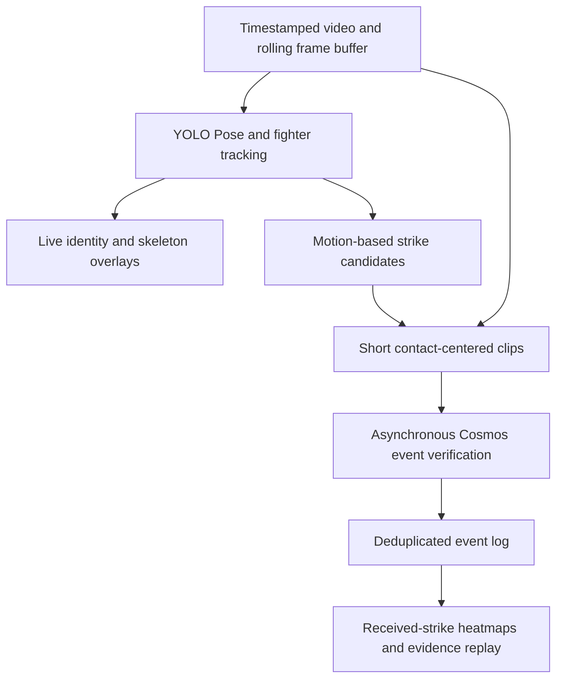

# FightLens

A real-time MMA viewing assistant that shows who struck whom, where contact occurred, and how the exchange unfolded.

Built for the Real-Time Video Agents Hack — NYC, October 9, 2026.

**Status: project planning.** This repository currently contains the project brief and pipeline design. There is no working application, trained strike classifier, or measured performance result yet.

## First milestone

Use a 30–60 second standing-exchange video with both fighters clearly visible to evaluate:

- Stable fighter identity: A and B remain correctly assigned throughout the clip.
- Attack direction: who attacked whom.
- Contact location: head, torso, or leg.
- Outcome: landed, blocked, missed, unknown, or not a strike.
- End-to-end latency when frames are processed at the video's original playback speed.

The planned viewer interface combines the video, fighter tracking overlays, received-strike heatmaps, and a timestamped event list with evidence replay.

## Proposed pipeline



See [the pipeline and validation plan](docs/PIPELINE.md) for model choices, event definitions, latency budgets, and acceptance criteria.

## Planned tools

| Tool | Proposed role | Status |
| --- | --- | --- |
| Ultralytics YOLO Pose + ByteTrack / BoT-SORT | Fighter tracking, pose estimation, and candidate generation | Planned |
| NVIDIA Cosmos video-understanding endpoint | Review short candidate clips | Planned; event endpoint and model version to confirm |
| VAST | Store video evidence and event metadata | Planned; access to confirm |
| Weights & Biases / Weave | Record experiments, model calls, and latency | Planned; access to confirm |

These entries describe intended integrations, not completed integrations or confirmed sponsor eligibility.

## Scope and evidence

- A heatmap represents detected received strikes, not a medical injury assessment or impact-force measurement.
- A blocked strike is recorded separately from a direct hit to the intended body region.
- Unclear contact stays unknown rather than being forced into a binary answer.
- Win-probability prediction is a later research task requiring historical evaluation and calibration. No validated win-probability model is included.
- Single-clip results will establish limited feasibility, not general reliability across MMA broadcasts.

## Next actions

- [ ] Select a continuous 30–60 second test video and keep it outside Git.
- [ ] Annotate attacks, outcomes, body regions, and uncertain events.
- [ ] Run pose and identity tracking on the first 10 seconds.
- [ ] Add candidate generation and event deduplication.
- [ ] Benchmark the available Cosmos endpoint on short clips.
- [ ] Compare geometry-only and Cosmos-assisted decisions on held-out footage.
- [ ] Build the heatmap, event list, and evidence replay interface.
- [ ] Record a three-minute project demo and make the repository accessible to reviewers.

## Cosmos per-second video understanding smoke test

`scripts/cosmos_video_understanding.py` implements the first end-to-end model path:

1. Split the input into complete one-second windows.
2. Sample five ordered JPEG frames at `+0.1`, `+0.3`, `+0.5`, `+0.7`, and `+0.9` seconds.
3. Send the fixed UFC scene-observer system prompt and one Cosmos3 Reason request per
   source-video second using NVIDIA NIM's temporal `video_frames` input.
4. Pass the previous successful second's complete scene JSON back as `previous_state`.
5. Append the structured scene result, raw model text, latency, usage, and any error to JSONL.

Run this inside the VAST Builders Challenge workshop VM, or locally after securely exporting
the Team bearer token. The VM's single `/config/<team>.config` contains
`GPU_BEARER_TOKEN`; the script reads that file without printing its values. It defaults to the
workshop Cosmos endpoint `http://166.19.38.112:8001`. `--api-base`,
`COSMOS3_REASON_URL`, or `COSMOS_API_BASE` can override that endpoint. Do not copy the bearer
token into source control. The workshop endpoint uses plain HTTP, so local calls expose the
bearer token and video frames to the network path; use it only from a trusted network.

First check local sampling without contacting Cosmos:

```sh
python3 scripts/cosmos_video_understanding.py \
  videos/pereira_rountree_45s.mp4 \
  --max-windows 1 \
  --dry-run
```

Then verify the workshop endpoint and discover its current model ID:

```sh
python3 scripts/cosmos_video_understanding.py --check
```

Run a single one-second inference before increasing the request count:

```sh
python3 scripts/cosmos_video_understanding.py \
  /path/to/permitted-test-video.mp4 \
  --fighter-map '{"A":"fixed identity or appearance","B":"fixed identity or appearance"}' \
  --max-windows 1
```

`--fighter-map` accepts inline JSON or `@/path/to/fighters.json`. It must contain exactly
the keys `A` and `B`; each value may be a non-empty string or JSON object. It is required for
inference so the model cannot silently reassign A/B based on screen position. The first
analyzed window receives `previous_state: null`; each later window receives the complete scene
JSON from the immediately preceding successful window.

Results default to `runs/cosmos/<video-stem>.jsonl`. Re-running resumes the file and skips only
the contiguous successful prefix whose video, model, fixed system prompt, fighter map, and
sampling configuration match the current run. This preserves the `previous_state` chain. Pass
`--overwrite` to start over. Non-JSON model output is stored as `invalid_response` and is retried
on a later run.
`--realtime` paces request starts at one per source second when inference latency allows it.
Shared workshop GPUs may take longer than one second or return `429`; the client runs serially
and retries `429`, `5xx`, timeouts, and transient connection failures with backoff.
The client validates the fixed JSON schema and stops at the first failed window so it never
feeds a non-adjacent or malformed state into the next second.

The default `--media-mode auto` uses `video_frames`. If the workshop wrapper rejects that
NIM 1.7 input type, the same five frames are encoded as a one-second 5 FPS MP4 and retried as
`video_url` with `num_frames=5`.

For a local non-workshop NIM, copy `.env.example` to `.env` and fill the endpoint credentials.
Never commit `.env`. Run tests with:

```sh
python3 -m unittest discover -s tests -v
```

## References

- [Hackathon page](https://tokensand.com/vastnyc)
- [Ultralytics YOLO11](https://docs.ultralytics.com/models/yolo11/)
- [Ultralytics tracking](https://docs.ultralytics.com/modes/track/)
- [Cosmos 3 Reasoner NIM 1.7 API](https://docs.nvidia.com/nim/vision-language-models/1.7.0/examples/cosmos-reason3/api.html)
- [TapStats product preview](https://www.tapstats.live/app-tour) — a reference for spectator interaction; its preview describes manual crowd-sourced strike input.
